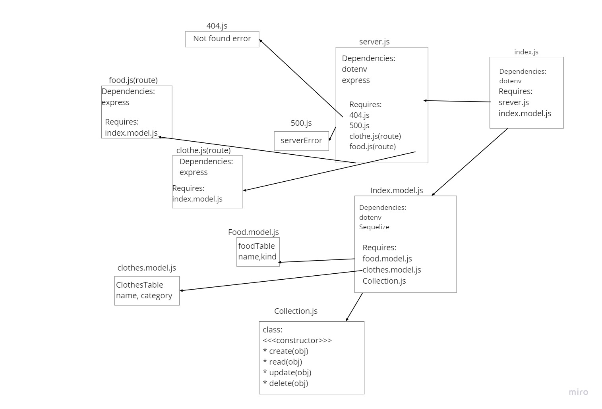

# api-server
## Herkua deployed URL:
[Herkua](https://shams-api-server.herokuapp.com/)

## Action :
[Acton](https://github.com/shamssar/api-server/actions)

## pull Request
[pull](https://github.com/shamssar/api-server/pull/1)

## Route:
- get all
foodRouter.get('/food', getFoods));

- Get One
foodRouter.get('/food/:id', getOneFood);

- Add
foodRouter.post('/food', addFood));

- updating
foodRouter.put('/food/:id', updateFood);

- deleting
foodRouter.delete('/food/:id', deleteFood);

## collection:
collection class

constructor (model)

creat(obj) method

read(id) method

update(id,obj)

delete(id)
## Testing:
### server.test.js tests:
- invalid route
- invalid method
- test if can add a food
- test if can get all foods
- test if can get one food
- test if can update a food
- test if can delete a food
### Deploy:
- ACP
- All Checked done
- Deploy on Herkuo.

### UML Digram :
